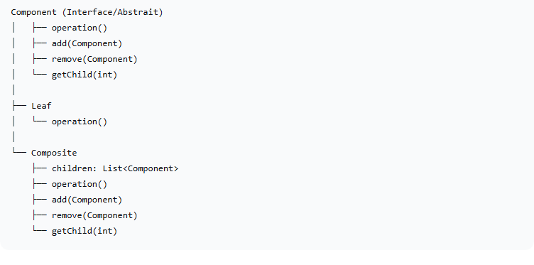
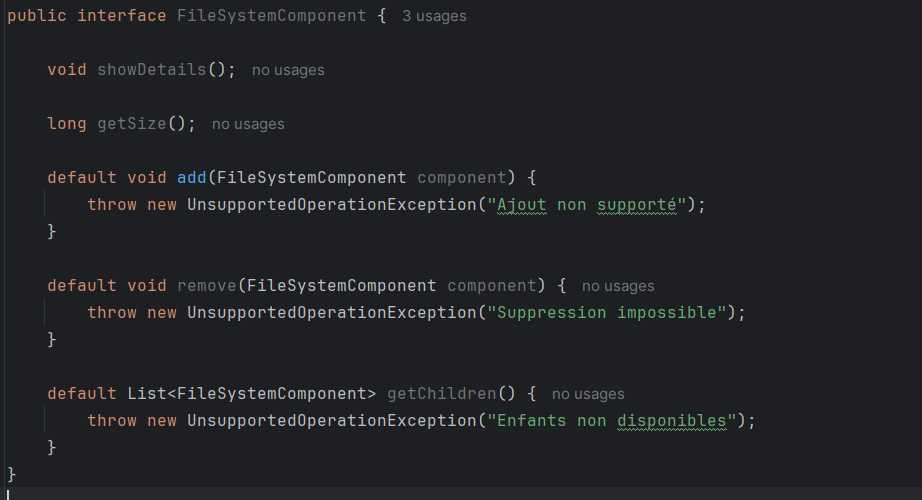
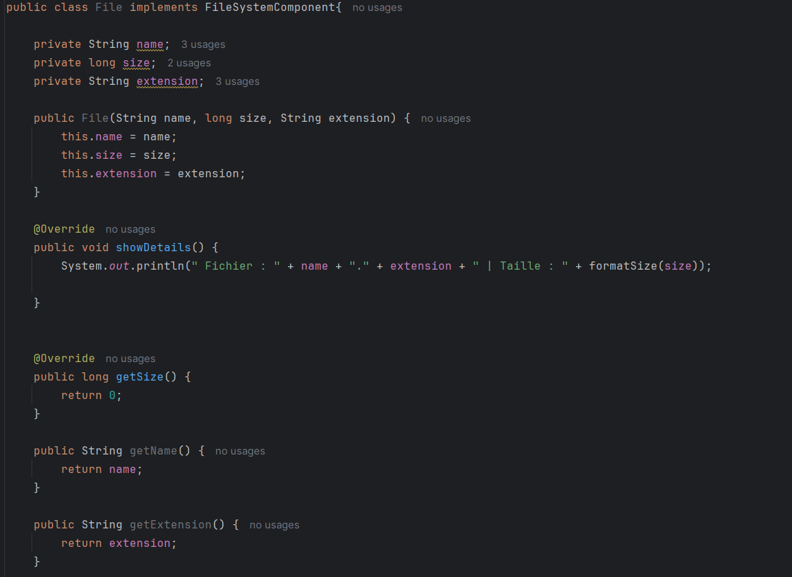
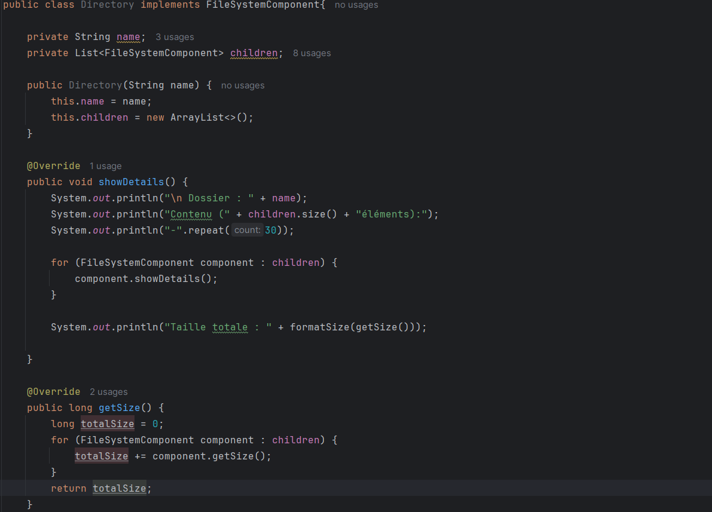
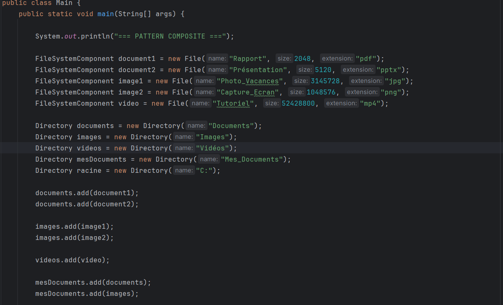
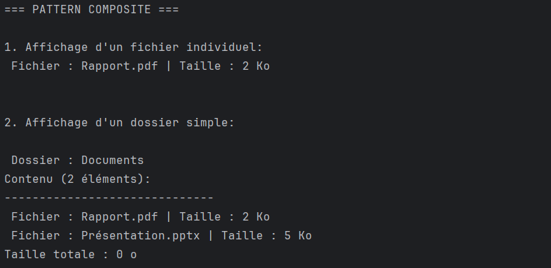

<h2>Design Pattern Composite</h2>
<h3>Présentation du Pattern Composite</h3>
Le <strong>pattern Composite</strong> est un design pattern structurel qui permet de composer des objets en structures arborescentes pour représenter des hiérarchies partie-tout. Il permet aux clients de traiter uniformément les objets individuels et les compositions d'objets.
<h3>Problématique</h3>
Comment manipuler des structures hiérarchiques complexes où certains objets peuvent être des éléments simples (feuilles) tandis que d'autres sont des conteneurs (composites) contenant d'autres objets, tout en fournissant une interface commune pour les deux types ? 

<h3>Solution</h3>
Le pattern Composite propose : 
<ul>
<li>Une interface commune (Component) pour tous les éléments de la structure</li>
<li>Des Leaf (feuilles) qui sont les éléments terminaux</li>
<li>Des Composite qui peuvent contenir d'autres Component (feuilles ou autres composites)</li>
</ul>

<h3>Structure</h3>

 

<h3>Exemple d'implémentation</h3>
Dans cet exemple d'implémentation, nous allons implémenter un système de fichiers (Fichiers et Dossiers).
 
<ol>
<li>Interface Component (Composant)</li>
 

 
 
<li>Classe Leaf (Feuille) - Fichier</li>
 

 
 
<li>Classe Composite - Dossier</li>
 

 
 
<li>Classe (Main) de démonstration</li>
 

 
 
<li>Test Terminal</li>
 

</ol>